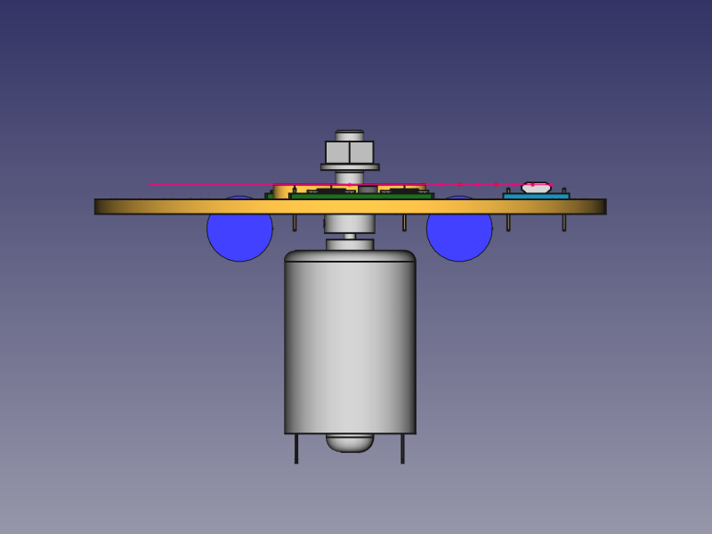

# POV simpletest
<!--lint disable list-item-indent-->
<!--lint disable list-item-bullet-indent-->

simple test to get a first *feeling* about something POV related ;-)

    
    

[--> video](https://vimeo.com/272761300)

---
# Contents
{:.no_toc}

* Will be replaced with the ToC, excluding the "Contents" header
{:toc}
---

## HW

- Motor Controller
    - [Arduino Micro](https://store.arduino.cc/arduino-micro) for Motor Speed Controller (with display and some buttons - for details see [Leonardo_wLCD_protobase](https://github.com/s-light/Leonardo_wLCD_protobase))
    - [IRLZ34N N-Channel Logic Level Power Mosfet](http://www.irf.com/product-info/datasheets/data/irlz34n.pdf)
    - [MBR1660](http://www.vishay.com/docs/87590/mbr1635.pdf) as freewheeling diode
- POV Controller
    - [Pololu A-Star Mini LV](https://www.pololu.com/product/3103) as POV Controller
    - [LEDBoard_4x4_16bit](https://github.com/s-light/LEDBoard_4x4_16bit) for output
    - 2x [SFH4550](https://www.osram.com/os/ecat/Radial%20T1%203-4%20SFH%204550/com/en/class_pim_web_catalog_103489/global/prd_pim_device_2219775/) IR-LED 850nm 3° (one as sender and one as receiver)

## Software

### SW_motordriver_wTacho
based on [Leonardo_wLCD_protobase](https://github.com/s-light/Leonardo_wLCD_protobase)

added IRLZ34N N-Channel Logic Level Power Mosfet and fast Diode for driving the Motor.

will add some sort of Feedback to measure actual speed.

### SW_simple_pov_TLC5971
based on [LEDBoard_4x4_16bit_HWTest](https://github.com/s-light/LEDBoard_4x4_16bit_HWTest).
implements basics to generate some very simple test-patterns for POV.

## TODO
- add RPM counter to Motor Controller
- try some more test patterns
