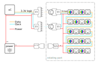

# POV infrared data transmission
<!--lint disable list-item-indent-->
<!--lint disable list-item-bullet-indent-->

idea here is to have a IR led directly pulsing the raw data out and an receiver converting it back to signal..
so this could be transmitted over the rotation contact-less.
challenge here is the bit time - we need some very very fast photo detectors...

---
# Contents
{:.no_toc}

* Will be replaced with the ToC, excluding the "Contents" header
{:toc}
---

## ToDo:
- find / decide which parts to test
- add schematics for
  - led control
  - photodiode / phototransistor handling

## bitrate / update-rate calculations

## information collection (research)
- Vishay
    - [Photo Detectors - Phototransistor Output](https://www.vishay.com/photo-detectors/phototrans-out/)
    - [Photo Detectors - Photodiode Output](https://www.vishay.com/photo-detectors/photodie-out/)
        - [digikey: Vishay TEFD4300F High-Speed Photodiodes](https://www.digikey.com/en/product-highlight/v/vishay-semi-opto/tefd4300-and-tefd4300f-high-speed-pin-photodiodes)
    - [Photo Detectors - Surface Mount Devices](https://www.vishay.com/photo-detectors/surface-mount-devices/)
    - [Optical Sensors - Transmissive](https://www.vishay.com/optical-sensors/transmissive-sensors/)
- Analog Devices
    - [LT1328 (4Mbps IrDA Infrared Receiver)](http://www.analog.com/en/products/interface-isolation/multiprotocol-transceivers/lt1328.html)
    - [ir photodiode used in demo board: BPV22NF](http://www.vishay.com/docs/81509/bpv22nf.pdf)
- TI
    - [OPA380	High Speed Precision Transimpedance Amplifier (also as dual variant)](http://www.ti.com/product/opa380)
    - [OPT101 Monolithic Photodiode and Single-Supply Transimpedance Amplifier](http://www.ti.com/lit/ds/symlink/opt101.pdf)

- [Why are most IR phototransistors slow?](https://electronics.stackexchange.com/questions/347665/why-are-most-ir-phototransistors-slow)
- [example with explanation to drive a phototransistors (optoisolators)](https://electronics.stackexchange.com/a/136944/13800)
- [Phototransistor Switching Time Analysis (app note)](http://www.cel.com/pdf/appnotes/an3009.pdf)

- [Anschluß Phototransistor für high-speed? (with schematics)](https://www.mikrocontroller.net/topic/198315#2101045)
- [mikrocontroller.net light-sensor basics](https://www.mikrocontroller.net/articles/Lichtsensor_/_Helligkeitssensor)

- [Ronja project](http://ronja.twibright.com/irrx/material.php)
    - [SFH 203 P](https://www.digikey.com/product-detail/en/osram-opto-semiconductors-inc/SFH-203-P/475-2649-ND/1893875)

- [some ideas and research to optical transmission with leds](https://electronics.stackexchange.com/questions/24214/using-a-led-to-transmit-data)
    - [photodiode OPF430 by Optek Inc](https://www.digikey.com/product-detail/en/tt-electronics-optek-technology/OPF430/365-1839-ND/1637898)
    - [TI OPA657 1.6GHz, Low Noise, FET-Input Operational Amplifier](http://www.ti.com/product/OPA657)

- [Driving LED in a Nanosecond Regime by a Fast Operational Amplifier](https://arxiv.org/pdf/1011.1954.pdf)

- [MAX3967A - 270Mbps SFP LED Driver](https://www.maximintegrated.com/en/products/comms/optical-communications/MAX3967A.html)
led driver for fiber optics
[MAX3967A: Improving Speed Performance of Slow LEDs Using the MAX3967A with Added Peaking Elements](https://www.maximintegrated.com/en/app-notes/index.mvp/id/3790)

[SN65ELT20  5-V TTL-to-Differential PECL Translator](http://www.ti.com/lit/ds/symlink/sn65elt20.pdf)

- eevblog
    - [high-speed-data-via-optocoupler](https://www.eevblog.com/forum/projects/high-speed-data-via-optocoupler/msg620446/#msg620446)
    - [Is a LED fast enough to strobe and is any color faster](https://www.eevblog.com/forum/projects/is-a-led-fast-enough-to-strobe-and-is-any-color-faster/msg583976/#msg583976)

[__recommend part for short length air coupled light data transmission?!__ (support thread at Texas Instruments)](https://e2e.ti.com/support/interface/fiber_communication/f/134/t/680726)

### High-Speed LED driver

- [fastest way of doing on/off-modulation of a LED?](https://electronics.stackexchange.com/questions/15818/fastest-way-of-doing-on-off-modulation-of-a-led#15830)
- [LEDs in fiber optics](http://www.fiber-optics.info/articles/light-emitting_diode_led)
    this link has some really good basic information about how to drive LEDs with high speed...
    (it contains three similar circuits.)

### High-Speed Receiver
[Anschluß Phototransistor für high-speed?](https://www.mikrocontroller.net/topic/198315#2101045)

## Parts

| part                                                         | type       | wavelength | housing    | capacitance  | rise/fall time  |
| :----------------------------------------------------------- | :--------: | :--------- | :--------- | -----------: | --------------: |
| [VEMT2020X01](http://www.vishay.com/docs/81595/vemt2000.pdf) | photodiode | 860nm      | SMD GW     |  25pF        | 2ns             |
| [VSMF4720](http://www.vishay.com/docs/81923/vsmf4720.pdf)    | led        | 870nm      | SMD PLCC-2 | 125pF        | 15ns            |
| [VSMY1850X01](http://www.vishay.com/docs/83317/vsmy1850.pdf) | led        | 850nm      | SMD 0805   | 125pF        | 10ns            |
| [TEMT7100X01](http://www.vishay.com/docs/81770/temt7100.pdf) | photodiode | 870nm      | SMD 0805   |  25pF        | 2ns             |
| [BSL214N](https://www.infineon.com/dgdl/Infineon-BSL214N-DS-v02_03-en.pdf) | NPN | DUAL 2.5V | SMD TSOP-6 | 4.1ns + 7.6ns | 6.8ns + 1.4ns |
| [IRLML0060TRPbF](https://www.infineon.com/dgdl/Infineon-IRLML0060-DS-v01_01-EN.pdf) | NPN | | SMD SOT-23 | 5.4ns + 6.3ns | 6.8ns + 4.2ns |

<!--
| [BSL205N](https://www.infineon.com/dgdl/Infineon-BSL205N-DS-v02_03-en.pdf) | NPN |        | SMD TSOP-6   |  -        | 11ns + 2.7ns  |
| [BSL306N](https://www.infineon.com/dgdl/Infineon-BSL306N-DS-v02_04-en.pdf) | NPN |        | SMD TSOP-6   |  -        | 8.3ns + 1.4ns |
 -->

[Vishay source for rise/fall times for photodiodes](https://www.vishay.com/docs/49071/_sg2166.pdf)

- [Infineon Small Signal and Small Power MOSFETs Selection guide](https://www.infineon.com/dgdl/Infineon-ProductSelectionGuide_SmallSignal_SmallPower_MOSFETs-SG-v02_00-EN.pdf)
    - <a href="https://www.infineon.com/cms/en/product/power/mosfet/small-signal-mosfet/20v-800v-n-channel-small-signal-mosfet/?filterValues=~(265~(~%27SMD)~529~(~%27N)~productStatusInfo~(~%27active*20and*20preferred))&visibleColumnIds=name,522,473_max,559_90_max,559_107_max,451_max,297_max,478_min,478_max,547_nom" target="_blank">Infineon 20V-800V N-Channel Small Signal MOSFET _Overview_</a>
    - <a href="https://www.infineon.com/cms/en/product/power/mosfet/20v-100v-n-channel-small-power-mosfet/?filterValues=~(productStatusInfo~(~%27active*20and*20preferred~%27active))&visibleColumnIds=name,productStatusInfo,522,473_max,559_max,529,451_max,451_52_max,451_49_max,547_nom,559_90_max" target="_blank">Infineon 20V-100V N-Channel Small Power MOSFET _Overview_</a>

## schematics

### High-Speed LED driver

### High-Speed Receiver

#### simple Phototransistor

#### Transimpedance Amplifier (TIA)

---
