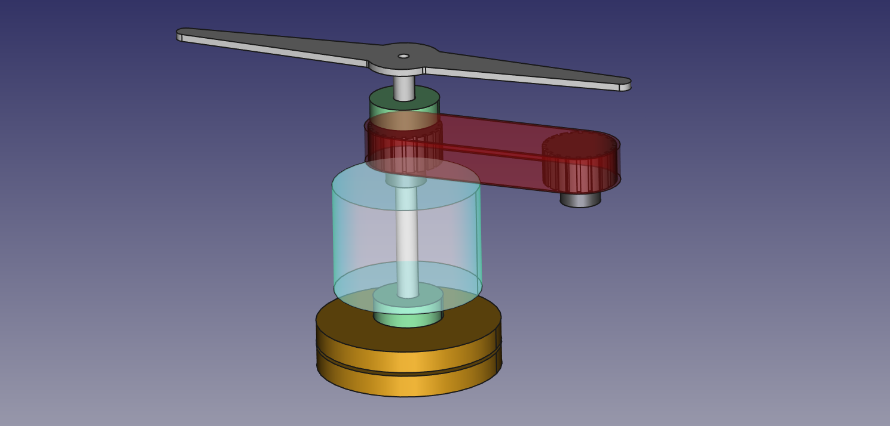

# POV mechanics
<!--lint disable list-item-indent-->
<!--lint disable list-item-bullet-indent-->

## info collection

## links
- [xiros® Flanschkugellager, verschraubbar, Kugeln aus Edelstahl, mm](https://www.igus.de/product/498)
- [xiros® Radialkugellager, xirodur B180, **Kugeln aus Glas**, Käfig aus xirodur B180, mm](https://www.igus.de/product/460)
- [Hollow/Both Ends Configurable](https://uk.misumi-ec.com/vona2/detail/110300007460/)
- [Pulleys T2,5, Belt Width 6 mm, Aluminium](http://maedler.de/product/1643/1616/986/zahnriemenraeder-t25-fuer-riemenbreite-6-mm-aus-aluminium)
