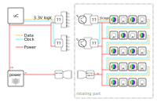

# POV
<!--lint disable list-item-indent-->
<!--lint disable list-item-bullet-indent-->

the idea is that the compass needle can rotate slow in both directions to *set* / *point* a direction of choice.

but also can spin up to about 1800rpm (= 30rps) and have LEDs to create a classic POV display.

on every half of the needle are 12..20 LEDs (APA102-2020 or Nichia NSSM124D with TLC5971 or something similar)
so we have a 12..20-Pixel high circle-screen.



some first simple tests are documented at [POV_simpletest](../../POV_simpletest)

---
# Contents
{:.no_toc}

* Will be replaced with the ToC, excluding the "Contents" header
{:toc}
---

## basic calculations

### 130mm Needle, 3mm Pixel Pitch

| name                                       | value           | formula                                                     | value |
| :----------------------------------------- | --------------: | ----------------------------------------------------------: | ----: |
| updates_per_second = revolution_per_second | 30              |                                                             | <input type="number" class="unit rpm" id="updates_per_second" value="30" step="1" min="0" max="120"/> |
| revolution per minute (RPM)                | 1800            | revolution_per_second * 60                                  | <span id="rpm"></span> |
| pixel_pitch                                | 3mm             |                                                             | <input type="number" class="unit millimeter" id="pixel_pitch" value="3" step="0.1" min="0" max="20" /> |
| needle_diameter                            | 130mm           |                                                             | <input type="number" class="unit millimeter" id="needle_diameter" value="130" step="1" min="0" max="500" /> |
| needle_active_radius                       | 60mm            | (needle_diameter - 10mm) / 2                                | <span id="needle_active_radius"></span> |
| pixel_count_one_side                       | 20              | needle_active_radius / pixel_pitch                          | <span id="pixel_count_one_side"></span> |
| pixel_count_total                          | 40              | pixel_count_one_side * 2                                    | <input type="number" class="" id="pixel_count_total" value="40" step="1" min="0" max="1000" /> |
| pixel_circumference                        | 408mm           | π * needle_diameter                                         | <span id="pixel_circumference"></span> |
| pixel_circumference_virtual_count          | 136             | pixel_circumference / pixel_pitch                           | <input type="number" class="" id="pixel_circumference_virtual_count" value="136" step="1" min="0" max="1440" /> |
| pixel_updates_per_revolution               | 136             | = pixel_circumference_virtual_count                         | <span id="pixel_updates_per_revolution"></span> |
| pixel_updates_per_second                   | 4080            | revolution_per_second * pixel_updates_per_revolution        | <span id="pixel_updates_per_second"></span> |
| pixel_updates_per_minute                   | 244800          | revolution_per_minute * pixel_updates_per_revolution        | <span id="pixel_updates_per_minute"></span> |
| duration_per_revolution                    | 33ms            | 1000ms / updates_per_second                                 | <span id="duration_per_revolution"></span> |
| duration_per_pixel                         | 242us           | duration_per_revolution / pixel_circumference_virtual_count | <span id="duration_per_pixel"></span> |
| pixel_pwm_rate_for_8bit       256          | 945ns   1,06MHz | duration_per_pixel /   256                                  | <span id="pixel_pwm_rate_for_8bit"></span> |
| pixel_pwm_rate_for_10bit     1024          | 236ns   4,24MHz | duration_per_pixel /  1024                                  | <span id="pixel_pwm_rate_for_10bit"></span> |
| pixel_pwm_rate_for_12bit     4096          |  59ns  16,95MHz | duration_per_pixel /  4096                                  | <span id="pixel_pwm_rate_for_12bit"></span> |
| pixel_pwm_rate_for_16bit    65535          | 3,7ns 270,27MHz | duration_per_pixel / 65535                                  | <span id="pixel_pwm_rate_for_16bit"></span> |

<button type="button" name="bt_update" id="bt_update">update</button>

<section>
| test | blub |
| :--- | :--- |
| sun  | sun  |
</section>

<section>
    <section>
        <h5>subsub...</h5>
        | test | blub |
        | :--- | :--- |
        | sun  | sun  |
    </section>
</section>

<script type="text/javascript">


</script>


```
reminder / helper

1 s                  = 1Hz
1 000 ms             = 1Hz
1 000 000 us         = 1Hz
1 000 000 000 ns     = 1Hz
1 000 000 000 000 ps = 1Hz

1s  = 1Hz
1ms = 1kHz
1us = 1MHz
1ns = 1GHz
1ps = 1THz
```


## links
- [Baupläne rotierendes Display (inductive transfer for power and data )](https://www.mikrocontroller.net/topic/80808#675198)
- [POV Poi with Teensy (APA102)](https://forum.pjrc.com/threads/30020-Teensy-APA102-POV-Poi-Pixel-Poi-Build-Tutorial/page11)

## LEDs
- [APA102-2020]()

- [APA-102-2020-P5 STRIP](http://neon-world.com/en/product_detail.php?cid=94&id=230)
- [MicroNova LED Strip, 198 LEDs/meter (60564)](https://solarbotics.com/product/60564/)

## LED-Driver
- APA102 (build into led)
- [TLC5971]()

| part                                         | data rate | pwm rate | channels | resolution | ch current | comment |
| :------------------------------------------- | :-------- | :------- | :------- | :--------- | :--------- | :------ |
| [APA102](https://cpldcpu.wordpress.com/2014/08/27/apa102/) | ~10 - 20MHz | 20kHz | 3 | 8Bit |  18mA      | simple to use - but no real datasheet values |
| [TLC5971](http://www.ti.com/product/TLC5971) | 20MHz     |  ?       | 12       | 16Bit      |  60mA      | internal oscillator, available libs |
| [TLC5947](http://www.ti.com/product/TLC5947) | 15MHz     |  4MHz    | 24       | 12Bit      |  30mA      | internal oscillator|
| [TLC5930](http://www.ti.com/product/TLC5930) | 20MHz     | 10MHz/20MHz | 12       | 10Bit      |  30mA      | internal oscillator|
| [TLC5943](http://www.ti.com/product/TLC5943) | 30MHz     | 33MHz    | 16       | 16Bit      |  50mA      | schnick-schnack-systems is useing these. needs external GS clock |


## infrared data transmission
[look at pov_datatransmission.md](pov_datatransmission.md)

## power transmission
[look at pov_powertransmission.md](pov_powertransmission.md)

## motor
[look at pov_motor.md](pov_motor.md)

## 3D
- [more research & brainstorming at POV_3D/](POV_3D/readme.md)
