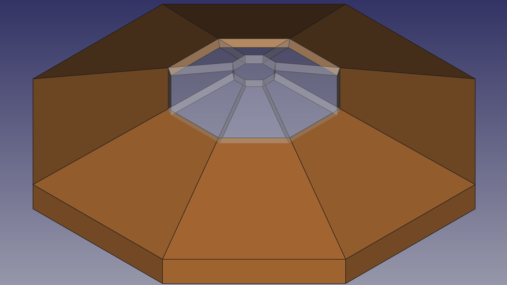
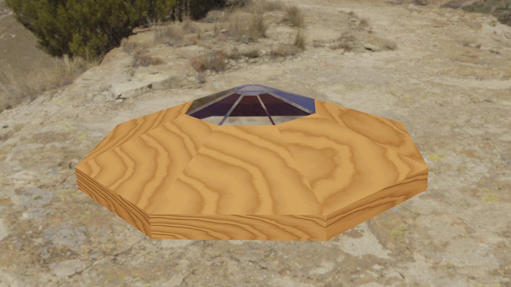
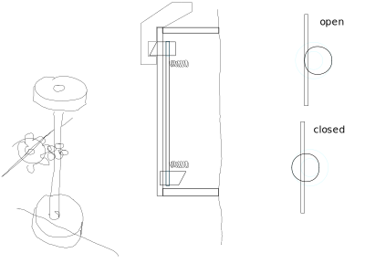

# cover
<!--lint disable list-item-indent-->
<!--lint disable list-item-bullet-indent-->

---
# Contents
{:.no_toc}

* Will be replaced with the ToC, excluding the "Contents" header
{:toc}
---

## ideas

### original
i think a lid/cover that can open and close (eventually automatic)
to 'protect' the glass is a good idea.

### update 25.07.2018
its better to have a cover that can be taken away -
so you also have nothing additionally laying around but
the lid is not in the way (the device is view-able from all around)...
→ release it from the top and attach it at the bottom
(locks in place at both positions)

## features
- attach / detach safely to the main housing (some release mechanism is needed)
- glowing crystal like structure at the top
- artwork

### release mechanism
ideas
- some push/toggle button on all four sides
- one or multiple (two or four) small rotating discs/locks
- spring-loaded mechanism for 'attach'
    - must be visually nice if not in use..

Bevel gears:
- [Bevel gear made of polyacetal resin die-cast](http://maedler.de/product/1643/1619/273/kegelraeder-aus-polyacetal-uebersetzung-11-51)
    - [module 0.5 16 teeth i=1:1 bore 3mm](http://maedler.de/Article/35520700) (needed depth: 16mm)
    - [module 1 16 teeth i=1:1 bore 5mm](http://maedler.de/Article/35550700) (needed depth: 28mm)
- [Bevel gear made of die-cast zinc ZnAl4Cu1](http://maedler.de/Article/35850700)
    - [module 1.0 16 teeth bore 6mm](http://maedler.de/Article/35850700)
- [Bevel Gears Made of Brass Ms58, milled, Ratio 1:1 - 4:1](http://maedler.de/product/1643/1619/273/kegelraeder-aus-messing-uebersetzung-11-bis-41)
    - [module 0.5 15 teeth i=1:1](http://maedler.de/Article/35020600) (needed depth: 14mm)
    - [module 0.5 20 teeth i=1:1](http://maedler.de/Article/35021100) (needed depth: 16mm)
    - [module 0.5 20 teeth i=2:1](http://maedler.de/Article/35026000) (needed depth: 21mm)
    - [module 0.5 40 teeth i=2:1](http://maedler.de/Article/35026100) (needed depth: 22mm)

### top crystal cone
transparent acrylic glass
on the inside add on some 2mm crushed glass or similar to create a 'mystical'
crystal effect.

### artwork
on the top of the lid i think a [Flower of Live](https://en.wikipedia.org/wiki/Overlapping_circles_grid) [(Blume des Lebens)](https://de.wikipedia.org/wiki/Blume_des_Lebens) or [something similar](https://openclipart.org/detail/17495/decorative-flower) is a good art-work.
for example:

or

