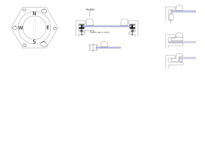

# input rim
<!--lint disable list-item-indent-->
<!--lint disable list-item-bullet-indent-->

---
# Contents
{:.no_toc}

* Will be replaced with the ToC, excluding the "Contents" header
{:toc}
---

## features
- easy smooth moving by hand
- automatic moving by hidden motor
- push action

## self build encoder
on underside of rim is a black/white pattern printed.  
(check that printing is really black for IR!!)
then read with two reflective ir sensor.
classical encoder gray-code pattern thing...
- [Overview: Optical Sensors - Reflective](https://www.vishay.com/optical-sensors/reflective-outputisnot-16/)
- [VCNT2020 2,5x2mm SMD package](https://www.vishay.com/optical-sensors/list/product-84285/)

## absolute position
for absolute position it would be possible to use a color sensor with an rainbow circle on the rim.
- AS7262
    - [Adafruit](https://www.adafruit.com/product/3779)
    - [sparkfun](https://www.sparkfun.com/products/14347)
- APDS9960
    - [Adafruit](https://www.adafruit.com/product/3595)
    - [sparkfun](https://www.sparkfun.com/products/12787)
- [ISL29125](https://www.sparkfun.com/products/12829)
- [BH1749NUC](https://www.sparkfun.com/products/14733)
- [TCS34725](https://www.adafruit.com/product/1334)

## push action
ring could be mounted on small springs -
this way the springs could be measured inductively.
this could give a pressure reading.
- [LDC1314 4-channel, 12-bit Inductance-to-Digital Converter with I2C for Inductive Sensing](http://www.ti.com/product/LDC1314)
- [FDC2114 Noise-immune Capacitive Sensing Solution for Proximity Sensing](www.ti.com/product/FDC2114)
- [FDC1004 4 Channel Capacitance to Digital Converter for Capacitive Sensing (Cap Sensing) Solutions](http://www.ti.com/product/FDC1004)

- [where are the devices listed?](https://e2e.ti.com/support/sensor/inductive-sensing/f/938/t/702434)
- [TI forum - sensor FAQ](https://e2e.ti.com/support/sensor/inductive-sensing/f/938/t/295036)

## mechanical
[bearing with rubber](https://www.bocabearings.com/products/ss3-10rmzz-2682)

## text

### 5-Elements
| element  | direction |
| :------- | :-------- |
| wood     | east      |
| fire     | south     |
| earth    | center    |
| metal    | west      |
| water    | north     |

### 4-Elements
[source](https://de.wikipedia.org/wiki/Vier-Elemente-Lehre)

| element  | direction |
| :------- | :-------- |
| fire     | south     |
| earth    | north     |
| air      | east      |
| water    | west      |
