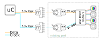

<!--lint disable list-item-indent-->
<!--lint disable list-item-bullet-indent-->
# POV

the idea is that the compass needle can rotate slow in both directions to *set* / *point* a direction of choice.

but also can spin up to about 1800rpm (= 30rps) and have LEDs to create a classic POV display.

on every half of the needle are 12..20 LEDs (APA102-2020 or Nichia NSSM124D with TLC5971 or something similar)
so we have a 12..20-Pixel high circle-screen.

## basic calculations

### 130mm Needle, 3mm Pixel Pitch

| name                                       | value   | formula             |
| :----------------------------------------- | ------: | ------------------: |
| updates_per_second = revolution_per_second | 30      |                     |
| revolution per minute (RPM)                | 1800    | revolution_per_second * 60 |
| pixel_pitch                                | 3mm     |                     |
| needle_diameter                            | 130mm   |                     |
| needle_active_radius                       | 60mm    | (needle_diameter - 10mm) / 2 |
| pixel_count_one_side                       | 20      | needle_active_radius / pixel_pitch |
| pixel_count_total                          | 40      | pixel_count_one_side * 2 |
| pixel_circumference                        | 408mm   | π * needle_diameter |
| pixel_circumference_virtual_count          | 136     | pixel_circumference / pixel_pitch |
| pixel_updates_per_revolution               | 136     | = pixel_circumference_virtual_count |
| pixel_updates_per_second                   | 4080    | revolution_per_second * pixel_updates_per_revolution |
| pixel_updates_per_minute                   | 244800  | revolution_per_minute * pixel_updates_per_revolution |

## links
- [Baupläne rotierendes Display (inductive transfer for power and data )](https://www.mikrocontroller.net/topic/80808#675198)
- [POV Poi with Teensy (APA102)](https://forum.pjrc.com/threads/30020-Teensy-APA102-POV-Poi-Pixel-Poi-Build-Tutorial/page11)

## LEDs
APA102-2020
- 

- [APA-102-2020-P5 STRIP](http://neon-world.com/en/product_detail.php?cid=94&id=230)
- [MicroNova LED Strip, 198 LEDs/meter (60564)](https://solarbotics.com/product/60564/)

## infrared data transmission
[look at pov_datatransmission.md](pov_datatransmission.md)

## power transmission
[look at pov_powertransmission.md](pov_powertransmission.md)

## motor
[look at pov_motor.md](pov_motor.md)

## 3D
- [more research & brainstorming at POV_3D/](POV_3D/readme.md)

---

## Test Setup

