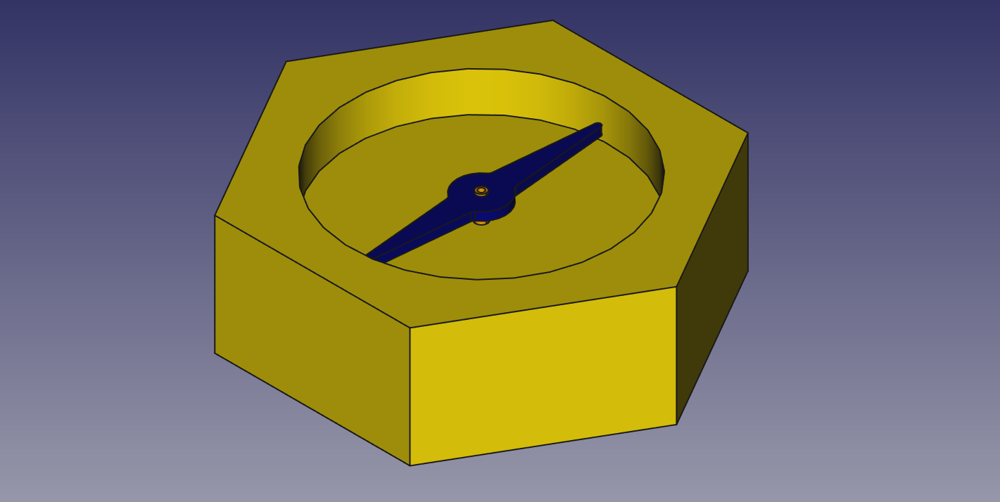
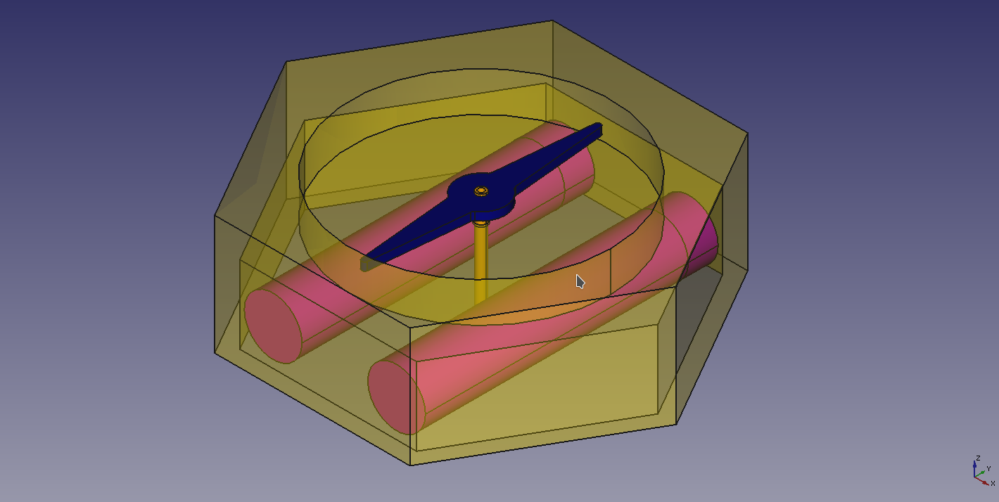
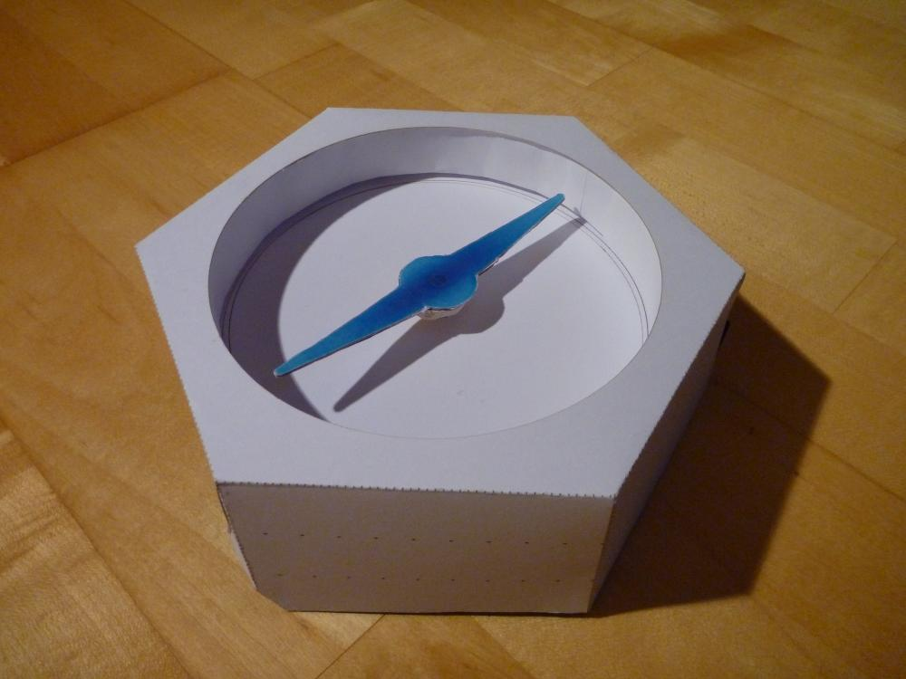
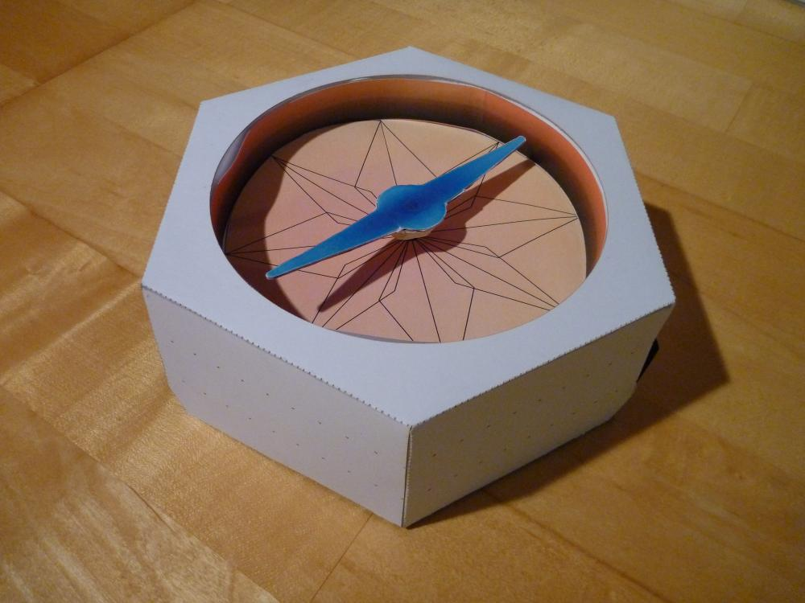

# ideas & concepts

<!--lint disable list-item-indent-->
<!--lint disable list-item-bullet-indent-->

    
    

    
    

---
# Contents
{:.no_toc}

* Will be replaced with the ToC, excluding the "Contents" header
{:toc}
---

## main processor
use a [PocketBeagle](https://beagleboard.org/pocket)
some useful hints
-[Ken Shirriff goes hands-on with the PocketBeagle](https://beagleboardfoundation.wordpress.com/2018/02/04/ken-shirrif-goes-hands-on-with-the-pocketbeagle/)
- [Hands-on with the PocketBeagle: a $25 Linux computer with lots of I/O pins](http://www.righto.com/2017/12/hands-on-with-pocketbeagle-tiny-25.html)
- [community capes](https://elinux.org/Beagleboard:BeagleBone_Capes)
- [buy at digikey 21, without USt](https://www.digikey.de/products/de?keywords=PocketBeagle)
- [buy at mouser 25,15€](https://www.mouser.de/_/?Keyword=PocketBeagle)

alternative: [BeagleCore](http://beaglecore.com/) Conrad: ~110€

## touch(less) input
buildin / hidden in the top outer edge is a copper surface that acts as electrode.
it is split in 4 parts and managed with an [FDC1004](https://github.com/s-light/TI_FDC1004_Breakout) or similar

this allows for 'hand waving gestures' and approach detection (hopefully ;-) )

## top input rim
[input_rim/](input_rim/)

## compass needle (POV display)

the idea is that the compass needle can rotate slow in both directions to *set* / *point* a direction of choice.

but also can spin up to about 1800rpm (= 30rps) and have LEDs on-top to create a classic POV display.
more details on this aspect can be found in [POV](POV/readme.md)

## wind rose
the printed graphics under the compass needle could also be turned individually -  
that gives a second level of abstraction -

here the idea is to rotate a thin acryl-plate - supported by 3 rollers around.
(where on is powered by a micro dc gear motor or something similar.. )

this needs some sort of indexing - so the thing knows where the disc is currently..

some illumination for this part should be also planned for..

motor for here could be this [700:1 Sub-Micro Planetengetriebemotor 6Dx21L mm](https://www.exp-tech.de/motoren/dc-getriebemotoren/7038/700-1-sub-micro-planetengetriebemotor-6dx21l-mm) one.
its 90RPM@6V

## Lid / Cover
[cover/](cover/)

## communication
the unit should have a W-LAN and / or 433MHz wireless communication link -
so it can be controlled from remote locations to set new values for position or text/image of needle or wind rose

## orientation
best solution would be a GPS + 9DOF inertial measurement unit..
so the thing can report the current absolute location and orientation over the communication channel back to the base and also
be used to route the user to a fixed absolute position (this is in sync with the naming part *Ortus* for *origin*.. )

### sensors
- MTK3339
    - [Ultimate GPS Module - 66 channel w/10 Hz updates - MTK3339 chipset ($29.95)](https://www.adafruit.com/product/790)
    - [Adafruit Ultimate GPS Breakout - 66 channel w/10 Hz updates - Version 3 ($39.95)](https://www.adafruit.com/product/746)
    - [Adafruit Ultimate GPS FeatherWing ($39.95)](https://www.adafruit.com/product/3133)
    - [pololu - 66-Channel LS20031 GPS Receiver Module (MT3339 Chipset) $49.95](https://www.pololu.com/product/2138)
    - [sparkfun - GPS Receiver - LS20031 5Hz (66 Channel) $59.95](https://www.sparkfun.com/products/8975)
- [sparkfun GPS](https://www.sparkfun.com/search/results?term=gps)
- [sparkfun GPS buying guide](https://www.sparkfun.com/pages/GPS_Guide)
- [Maestro Wireless A5100 GNSS Receiver](http://www.maestro-wireless.com/portfolio-items/a5100-a/) [mouser 17,05€](https://www.mouser.de/_/?Keyword=GNSS%20A5100-A)
    - GPS/GLONASS concurrent GNSS modules
    - Beidou / Galileo ready
    - Pin to pin compatible with A2200-A
    - Low tracking power consumption
- [Maestro Wireless A5135-H GNSS Receiver with Antenna](http://www.maestro-wireless.com/a5135-h-technical-specifications/)  [mouser 22,10€](https://www.mouser.de/_/?Keyword=GNSS%20A5135-H)
- [pololu UM7-LT Orientation Sensor](https://www.pololu.com/product/2763) [exp-tech 129,95€](https://www.exp-tech.de/sensoren/imu/5999/um7-lt-orientierungssensor)
- [BNO055](https://www.bosch-sensortec.com/bst/products/all_products/bno055)
    - [Adafruit 9-DOF Absolute Orientation IMU Fusion Breakout - BNO055](https://www.adafruit.com/product/2472) [exp-tech 35,35€](https://www.exp-tech.de/sensoren/beschleunigung/6446/adafruit-9-dof-absolute-orientation-imu-fusion-breakout-bno055?c=1090)
    - [BNO055 Absolute Orientation Sensor with Raspberry Pi & BeagleBone Black](https://learn.adafruit.com/bno055-absolute-orientation-sensor-with-raspberry-pi-and-beaglebone-black)
- [BNO080](https://www.bosch-sensortec.com/bst/products/all_products/bno080)
    - [Qwiic VR IMU (BNO080) Hookup Guide](https://learn.sparkfun.com/tutorials/qwiic-vr-imu-bno080-hookup-guide?_ga=2.203024980.490365886.1525245502-1455689428.1519465931) [exp-tech 33,68€](https://www.exp-tech.de/sensoren/beschleunigung/8757/sparkfun-vr-imu-breakout-bno080-qwiic?c=1090)
- [this project](https://hackaday.io/project/39158-odroid-xu4-based-control-computer) mentions that the BNO080 is more stable / less noisy

## power
in the bottom of the unit needs to be place for some LiPo / LiFe cells...
if the housing is made with an inner width of 180mm (the outer width of the paper model)
then two 2s1p inline LiFePo4 packs with 26650 form-factor can fit in the bottom..

most power hungry is the POV section.. more details there..
