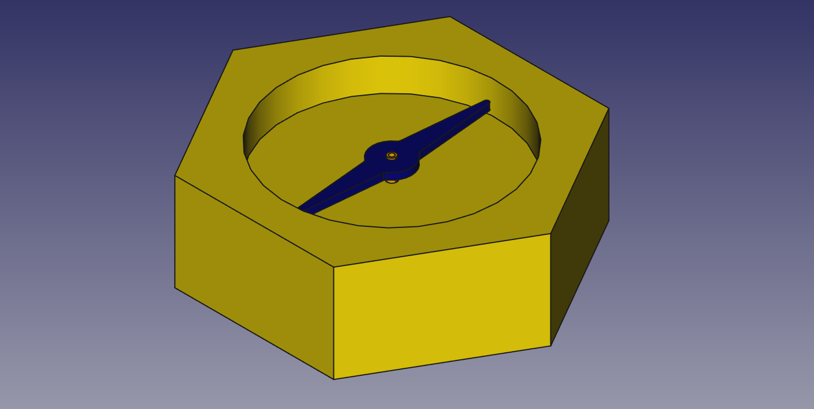
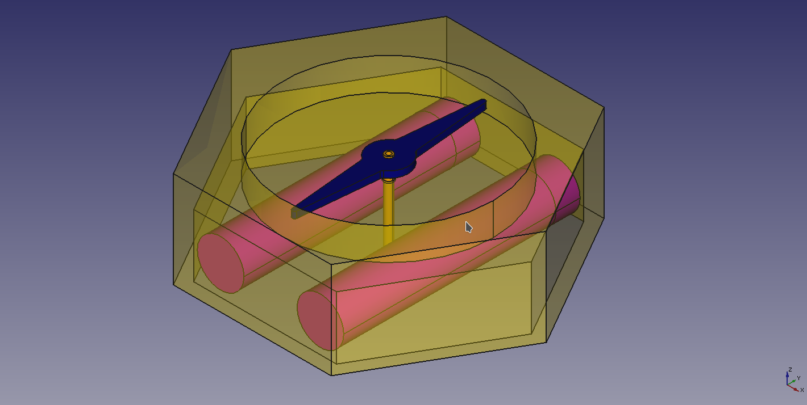

# ideas & concepts

<!--lint disable list-item-indent-->
<!--lint disable list-item-bullet-indent-->

    
    

    
    

---
# Contents
{:.no_toc}

* Will be replaced with the ToC, excluding the "Contents" header
{:toc}
---

## touch(less) input
buildin / hidden in the top outer edge is a copper surface that acts as electrode.
it is split in 4 parts and managed with an [FDC1004](https://github.com/s-light/TI_FDC1004_Breakout) or similar

this allows for 'hand waving gestures' and approach detection (hopefully ;-) )

## top input rim
[input_rim.md](input_rim.md)

## compass needle (POV display)

the idea is that the compass needle can rotate slow in both directions to *set* / *point* a direction of choice.

but also can spin up to about 1800rpm (= 30rps) and have LEDs on-top to create a classic POV display.
more details on this aspect can be found in [POV](POV/readme.md)

## wind rose
the printed graphics under the compass needle could also be turned individually -  
that gives a second level of abstraction -

here the idea is to rotate a thin acryl-plate - supported by 3 rollers around.
(where on is powered by a micro dc gear motor or something similar.. )

this needs some sort of indexing - so the thing knows where the disc is currently..

some illumination for this part should be also planned for..

motor for here could be this [700:1 Sub-Micro Planetengetriebemotor 6Dx21L mm](https://www.exp-tech.de/motoren/dc-getriebemotoren/7038/700-1-sub-micro-planetengetriebemotor-6dx21l-mm) one.
its 90RPM@6V

## Lid
i think a lid that (eventually) can open and close to 'protect' the glas is a good idea.
on the top of the lid i think a [Flower of Live](https://en.wikipedia.org/wiki/Overlapping_circles_grid) [(Blume des Lebens)](https://de.wikipedia.org/wiki/Blume_des_Lebens) or [something similar](https://openclipart.org/detail/17495/decorative-flower) is a good art-work.
for example:

or

## communication
the unit should have a W-LAN or 433MHz wireless communication link -
so it can be controlled from remote locations to set new values for position or text/image of needle or wind rose

## orientation
best solution would be a GPS + 9DOF inertial measurement unit..
so the thing can report the current absolute location and orientation over the communication channel back to the base and also
be used to route the user to a fixed absolute position (this is in sync with the naming part *Ortus* for *origin*.. )

## power
in the bottom of the unit needs to be place for some LiPo / LiFe cells...
if the housing is made with an inner width of 180mm (the outer width of the paper model)
then two 2s1p inline LiFePo4 packs with 26650 form-factor can fit in the bottom..

most power hungry is the POV section.. more details there..
